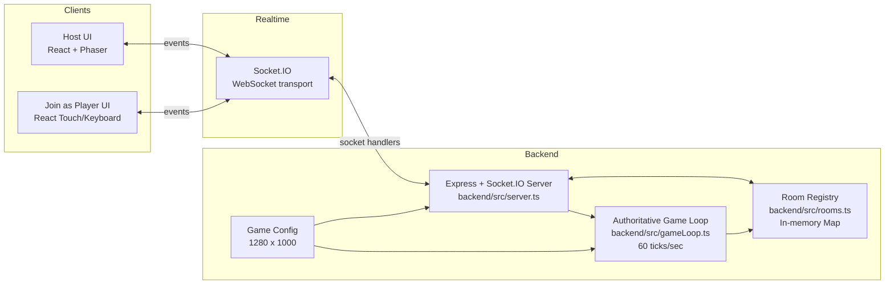

# Curvefever TV — Design Document

Last updated: 2026-03-18

## 1. Product Summary

Curvefever TV is a real-time multiplayer party game where:

- One device acts as the **Host** (TV/laptop screen) and renders the arena.
- Multiple phones act as **Controllers** and send left/right input.
- Players join with a **4-letter room code**.
- The backend is **authoritative** for movement, collisions, scoring, and round state.

## 2. Current Scope

### Included

- Host role and phone-controller role selection
- Host room creation and host session reconnect
- Player join and player reconnect (session-based)
- Lobby updates with connection status
- Two game modes:
  - `classic` (score race to target score)
  - `battle-royale` (elimination until one remains)
- Real-time game loop with collision detection
- Round-over + delayed round restart
- Game-over leaderboard

### Not Included

- User accounts / authentication
- Persistent database storage
- Match history
- Spectator mode
- Power-ups

## 3. Architecture

### Mermaid architecture diagram

### Core architectural decisions

- **Authoritative server model**: clients send inputs, server computes outcomes.
- **In-memory state**: rooms, players, and game state are process-local (`Map`s).
- **Socket.IO rooms**: each game room uses a 4-letter code and socket room channel.
- **WebSocket transport only**: configured with `transports: ["websocket"]`.

## 4. Runtime Components

### Backend (`backend/src`)

- `server.ts`
  - Socket lifecycle and event handlers
  - Room creation/join/rejoin/leave
  - Host reconnection and lobby sync
  - Game mode updates and game start
- `rooms.ts`
  - In-memory room store and room code generation
- `gameLoop.ts`
  - Tick loop, movement, trails, gaps, collisions
  - Scoring and elimination logic
  - Round/game end events and restart scheduling
- `config.ts`
  - Arena dimensions: `1280 x 1000`

### Frontend (`curvefever-frontend/src`)

- `App.tsx`
  - Role selection (`host` or `phone`), persisted in localStorage
- `Host.tsx`
  - Host lifecycle, lobby, leaderboard, game controls, reconnect flow
  - Renders `PhaserGame` as the arena view
- `PlayerController.tsx`
  - Join/rejoin flow, touch controls, keyboard fallback
  - Sends input at ~16ms while pressed
- `socket.ts`
  - Socket.IO client setup using `VITE_BACKEND_URL`

## 5. Data Model (Current)

### Player

- `id`, `name`, `score`
- `socketId` (nullable for disconnected players)
- `alive`, `x`, `y`, `direction`, `speed`
- Trail + gap fields used by server simulation
- Input hold flags (`turnLeftHeld`, `turnRightHeld`) on backend

### Room

- `code`, `hostSocketId`, `players`, `state`
- `gameMode`: `classic | battle-royale`
- `targetScore` for classic mode
- `battleRoyaleEliminatedPlayerIds` set
- `game` snapshot reference (nullable)

## 6. Networking Contract

### Client → Server events

- `createRoom`
- `reconnectHost`
- `joinRoom`
- `rejoinRoom`
- `requestLobbyState`
- `input`
- `setGameMode`
- `startGame`
- `leaveRoom`

### Server → Client events

- `playerJoined`
- `lobbyUpdate`
- `startGame`
- `gameState`
- `roundOver`
- `roundRestart`
- `gameOver`
- `roomClosed`

## 7. Gameplay Engine

### Tick behavior

- Loop runs at **60 ticks/sec** (`1000 / 60` ms)
- State broadcast currently every **2 ticks** (effectively ~30 broadcasts/sec)
- Turn rate is applied from held input flags on each tick

### Trail and movement

- Players move forward continuously from heading angle
- Trail is segmented and supports gap intervals
- Round-start no-trail window avoids immediate spawn collisions

### Collision rules

- Wall collision
- Player-to-player proximity collision
- Trail collision (self and others)
- Grace period after restart to reduce instant re-collision

## 8. Mode Rules

### Classic

- Target score is computed as: `max(10, players * 10 - 10)`
- Surviving players gain points when others die
- On reaching target score, emit `gameOver` with sorted leaderboard

### Battle Royale

- Eliminated players remain out for the match
- Round restarts continue until one survivor remains
- On final survivor, emit `gameOver`

## 9. Session + Reconnect Behavior

- Host stores room session in localStorage (`curvefever:hostSession`)
- Controller stores room/name/playerId (`curvefever:playerSession`)
- Player rejoin timeout is 7 seconds in controller UI
- Disconnecting players are marked by `socketId = null` (not immediately deleted)

## 10. Operational Notes

- Backend default port: `3001`
- CORS origin from `CORS_ORIGIN` env (fallback `*`)
- Current persistence model means server restart clears all active rooms

## 11. Known Constraints / Follow-ups

- State is single-process only (no shared store / horizontal scaling)
- No anti-lag interpolation or client prediction layer yet
- No replay or telemetry pipeline
- No auth/rate-limiting protections for public deployment

